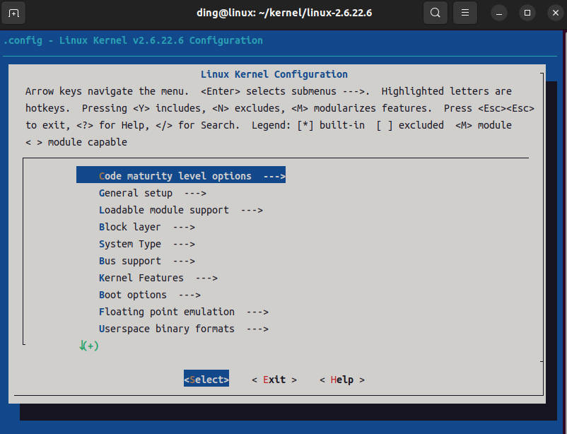
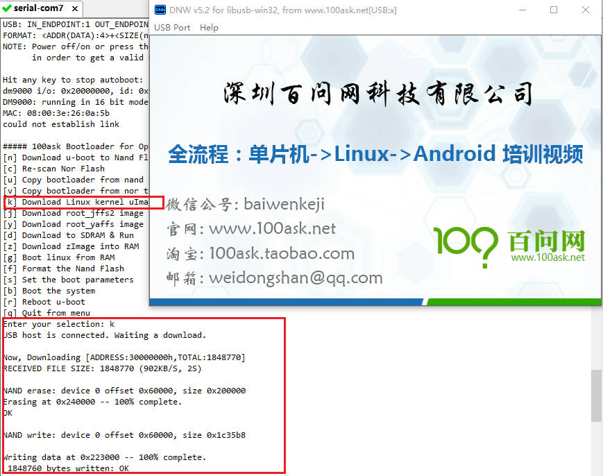
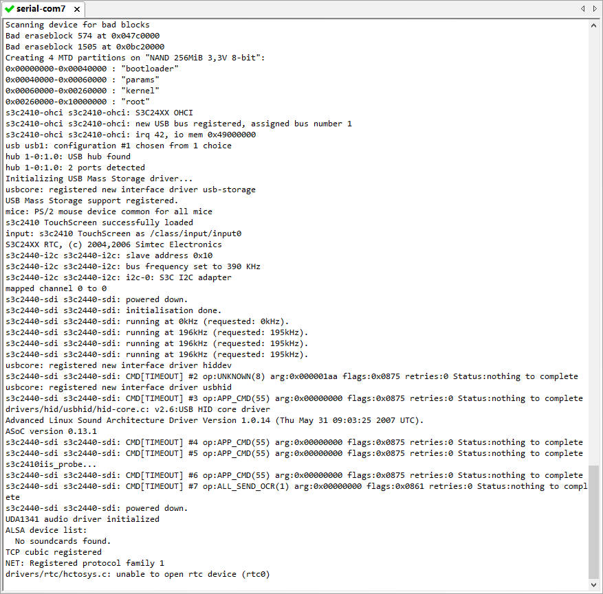

# Linux内核编译

Linux内核编译包括下面3个过程：

1. 解压 + 打补丁
2. 配置
3. 编译

## 1. 解压 + 打补丁

```sh
# 1. 解压linux内核
tar xjvf linux-2.6.22.6.tar.bz2

# 2. 打补丁
cd linux-2.6.22.6
patch -p1 < ../linux-2.6.22.6_jz2440_v2v3.patch
```

## 2. 配置过程

怎么配置？有3种方法：

1. `make menuconfig` ： 每一项都自己配置
   
    从头到尾有成千上万个配置项，需要一个个来配置，太麻烦了

    

    + Y ： 编译进内核
    + N ： 不编译
    + N ： 编译成模块
    + 空格 ： 可以在Y N M三种状态切换
    + ? ： 查看帮助
    + / ： 查找字符串

2. 使用默认的配置，在上面修改
   
    可以使用命令`find -name "*defconfig`，来查看有哪些默认配置

    ```sh
    find -name "*defconfig"
    ./arch/m68k/configs/q40_defconfig
    ...
    ./arch/m68k/defconfig
    ./arch/ppc/configs/ocotea_defconfig
    ...
    ./arch/cris/defconfig
    ./arch/cris/arch-v10/defconfig
    ./arch/powerpc/configs/prpmc2800_defconfig
    ...
    ./arch/powerpc/configs/mpc885_ads_defconfig
    ./arch/blackfin/configs/BF533-EZKIT_defconfig
    ...
    ./arch/x86_64/defconfig
    ./arch/m32r/defconfig
    ./arch/arm26/defconfig
    ./arch/sparc64/defconfig
    ./arch/h8300/defconfig
    ./arch/um/defconfig
    ./arch/arm/configs/lpd7a400_defconfig
    ...
    ./arch/arm/configs/s3c2410_defconfig    # 跟我们2440最相近的默认配置，可以基于这个配置来修改
    ...
    ./arch/m68knommu/defconfig
    ./arch/sparc/defconfig
    ...
    ```

    在`/arch/arm/configs/`目录下，只有`s3c2410_defconfig`文件跟我们的单板最像。如下执行命令：

    + `make s3c2410_defconfig` ： 使用默认配置，所有的配置项写入`.config`文件
    + `make menuconfig` ： 读出`.config`文件创建`menuconfig`界面，在上面进行修改

3. 使用厂家提供的配置文件
   
    + 把厂家提供的配置文件，复制为`.config`文件
    + `make menuconfig`

    对于JZ2440开发板，厂家提供的配置文件就是`config_ok`，所以我们执行以下命令：

    ```sh
    cp config_ok .config
    make menuconfig
    ```

## 3. 编译

配置过程完成后，如何进行编译？

+ `make` ： 直接编译
+ `make uImage` ： 编译生成`uImage`

注意，直接执行`make uImage`可能会有以下报错，原因是找不到`mkimage`命令。`mkimage`是什么？

```sh
"mkimage" command not found - U-Boot images will not be built
```

`mkimage`是我们编译boot时生成的，位于uboot工程的`/tools`目录下，所以我们要把uboot编译出来的`mkimage`复制到系统的环境变量中，这样才可以顺利编译得到uImage。

```sh
# 在uboot目录下，拷贝mkimage到安装编译器的路径下
sudo cp ./tools/mkimage /usr/local/arm/gcc-3.4.5-glibc-2.3.6/bin/
```

## 4. 烧录内核

现在2440中已经烧录了uboot，我们也编译得到了内核uImage，可以通过内核使用USB来烧录uImage。烧录过程如下：

+ 进入uboot，输入`k`选择下载uImage内核
+ 使用DNW软件，选择uImage文件
+ 烧录完成后，在uboot中输入`boot`即可加载内核执行



## 5. 运行内核

由于我们先擦除了根文件系统，内核最终会卡住。


