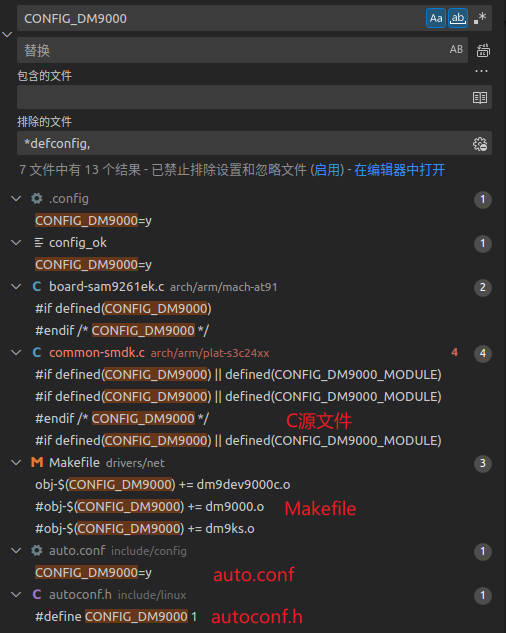

# Linux内核配置

之前第一节讲到的3种配置方式（[内核编译体验](../001_内核启动流程分析之编译体验/readme.md)），最终结果都是为了生成`.config`文件。

我们分析内核配置，就得先看`.config`文件。

## 1 `.config`文件

以DM9000为例，来分析`.config`文件。config文件有很多项，称为配置项。配置项等于`y`（编进内核），或者等于`m`（编译成模块），或者等于某个值。

```mk
#
# Ethernet (10 or 100Mbit)
#
CONFIG_NET_ETHERNET=y
CONFIG_MII=y
# CONFIG_SMC91X is not set
CONFIG_DM9000=y
# CONFIG_CS89x0 is not set
# CONFIG_NET_POCKET is not set
CONFIG_NETDEV_1000=y
CONFIG_NETDEV_10000=y
```

接下来看下`CONFIG_DM9000`这个配置项谁来使用：

1. C源码
2. 子目录`Makefile` ：`drivers/net`
3. `include/config/auto.conf`
4. `include/linux/autoconf.h`



C源码中使用了`CONFIG_DM9000宏定义`，那么这个宏是哪里来的？显然来自于头文件`autoconf.h`。从名字上看，这个头文件是自动生成的。怎么生成的？执行make时根据`.config`文件自动生成的。

`autoconf.h`中，配置项定义为1。所以，不管`CONFIG_DM9000`的值是`y`或`m`，在头文件中都被定义为1，C源码中就会使用这些宏了。

```c
#define CONFIG_DM9000 1
```

那么问题来了，`CONFIG_DM9000`的值是`y`或`m`，区别在哪里体现？既然在C语言中体现不出来，那肯定得有其他地方在体现，具体来说就是在Makefile中体现的。

子目录`Makefile` 显然，如果变量CONFIG_DM9000被定义为y，就是obj-y编译进内核；如果变量CONFIG_DM9000被定义为m，就是obj-m编译成模块。

```makefile
obj-$(CONFIG_DM9000) += dm9000.o
```

那么子目录`Makefile`中的CONFIG_DM9000是谁来定义的？答案是由`include/config/auto.conf`定义的。这个文件也是来源于`.config`文件，执行make时自动生成的。

`auto.conf`

```makefile
CONFIG_DM9000=y     # CONFIG_DM9000定义成y
```

## 2 内核子目录`Makefile`

内核子目录的Makefile非常简单，就两种形式：

```makefile
obj-y += xxx.o  # 形式1：编译进内核
obj-m += yyy.o  # 形式2：编译成可加载的ko模块
```

## 3 总结

当我们执行`make uImage`时，会发生下面的事情：

1. `.config`被用来自动生成`autoconf.h` ：被源代码使用
2. `.config`被用来自动生成`auto.conf` ： 被顶层`Makefile`来包含，子目录`Makefile`来使用

注意，在`obj-$(CONFIG_DM9000) += dm9000.o`中，如果`CONFIG_DM9000=n`或`CONFIG_DM9000未定义`，即`obj-n`或`obj-空`，内核在make时不会处理它，表示文件不会使用，这就是make的结果。
