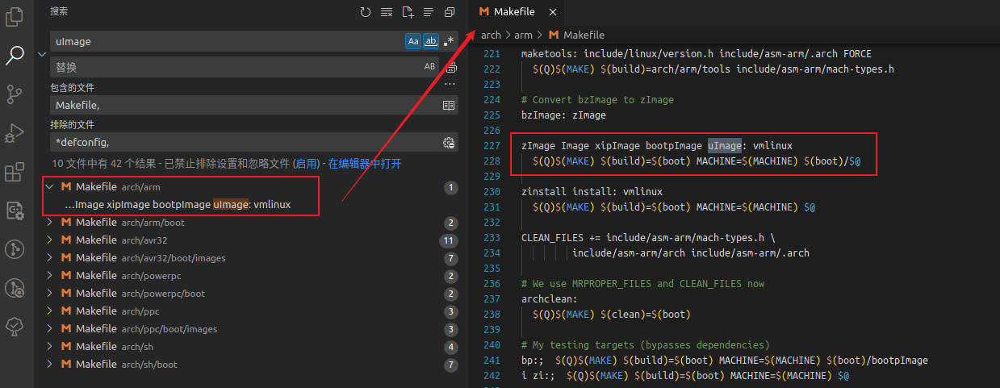

# 内核Makefile

Linux内核的`Makefile`可以分成五类：

| 名称 | 描述 |
| - | -|
| 顶层Makefile | 它是所有Makefile的核心，从总体上控制着内核的编译、链接 |
| `.config` | 配置文件，在配置内核时生成。所有Makefile（包括顶层目录及各级子目录）都是根据`.config`来决定使用哪些文件 |
| arch/$(ARCH)/Makefile | 对应体系结构的Makefile，它用来决定哪些体系结构相关的文件参与内核的生成，并提供一些规则来生成特定格式的内核镜像 |
| scripts/Makefile.* | Makefile共用的通用规则、脚本等 |
| kbuild Makefiles | 各级子目录下的Makefile，他们相对简单，被上一层的Makefile调用来编译当前各级目录下的文件 |

其中，`.config`上一节已经分析过了，接下来重点分析`顶层Makefile`，`架构Makefile`和`子目录Makefile`。

## 1. 子目录Makefile

 以`drivers/char/Makefile`为例。可以看到，子目录Makefile就是`obj-y`和`obj-m`的组合。

 ```makefile
obj-y	 += mem.o random.o tty_io.o n_tty.o tty_ioctl.o

obj-m    += s3c24xx_leds.o
obj-m    += s3c24xx_buttons.o
obj-m    += ker_rw.o
obj-$(CONFIG_LEGACY_PTYS)	+= pty.o
obj-$(CONFIG_UNIX98_PTYS)	+= pty.o
obj-y				+= misc.o
obj-$(CONFIG_VT)		+= vt_ioctl.o vc_screen.o consolemap.o \
				   consolemap_deftbl.o selection.o keyboard.o
obj-$(CONFIG_HW_CONSOLE)	+= vt.o defkeymap.o
obj-$(CONFIG_MAGIC_SYSRQ)	+= sysrq.o
obj-$(CONFIG_ESPSERIAL)		+= esp.o
obj-$(CONFIG_MVME147_SCC)	+= generic_serial.o vme_scc.o
obj-$(CONFIG_MVME162_SCC)	+= generic_serial.o vme_scc.o
obj-$(CONFIG_BVME6000_SCC)	+= generic_serial.o vme_scc.o
obj-$(CONFIG_ROCKETPORT)	+= rocket.o
obj-$(CONFIG_SERIAL167)		+= serial167.o
 ```

## 2. ARCH架构Makefile

我们使用的是arm架构，接下来分析架构Makefile。我们分析Makefile，就从他的命令来分析。我们编译内核时，直接输入`make`或`make uImage`。



`uImage`位于`arch/arm`架构路径下，但我们是在顶层目录执行`make uImage`的，合理猜测一下，这个架构Makefile会被包含进顶层Makefile里面去。

可以看到，uImage依赖于vmlinux。

```makefile
zImage Image xipImage bootpImage uImage: vmlinux
	$(Q)$(MAKE) $(build)=$(boot) MACHINE=$(MACHINE) $(boot)/$@
```

## 3. 顶层Makefile

+ `包含auto.conf`

    ```makefile
    # Objects we will link into vmlinux / subdirs we need to visit
    init-y		:= init/
    drivers-y	:= drivers/ sound/
    net-y		:= net/
    libs-y		:= lib/
    core-y		:= usr/
    endif # KBUILD_EXTMOD

    ifeq ($(dot-config),1)
    # Read in config
    -include include/config/auto.conf
    ```

+ `包含架构Makefile`

    ```makefile
    # The all: target is the default when no target is given on the
    # command line.
    # This allow a user to issue only 'make' to build a kernel including modules
    # Defaults vmlinux but it is usually overridden in the arch makefile
    all: vmlinux

    ifdef CONFIG_CC_OPTIMIZE_FOR_SIZE
    COPTIMIZE	= -Os
    else
    COPTIMIZE	= -O2
    endif
    # COPTIMIZE may be overridden on the make command line with
    # 	make ... COPTIMIZE=""
    # The resulting object may be easier to debug with KGDB
    CFLAGS		+= $(COPTIMIZE)

    include $(srctree)/arch/$(ARCH)/Makefile    # 包含了架构Makefile
    ```


## 总结

+ 子目录Makefile ： 很简单，`obj-y += xxx` 和 `obj-m += xxx`